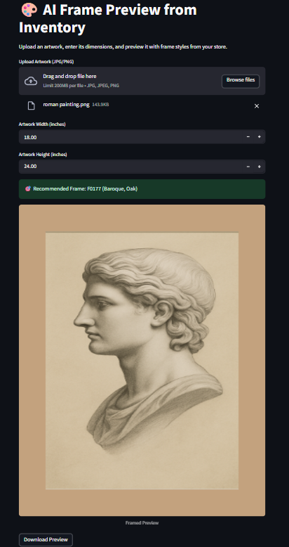

# AI Frame Recommender + Visualizer App

This project is an AI-powered frame recommendation and visualization tool built with Python and Streamlit. Users can upload an image of an artwork and receive smart frame style recommendations from an inventory. The selected frame is automatically applied around the painting in a realistic preview.

---

## Features

- Upload artwork image and input dimensions (in inches)
- Recommend a frame style based on AI embeddings
- Realistically preview the artwork inside the selected frame
- Visualized with PIL (Python Imaging Library) and Streamlit
- Modular pipeline: frame generation, metadata embedding, UI preview

---

## Project Structure

```
├── app.py # Streamlit app
├── recommend_frame.py # Recommend frames using embeddings
├── create_frame_preview # Create a simulated uploaded painting with frame
├── crt_images.py # Generate placeholder frame images with metadata
├── convert_metadata_description.py # Add natural language descriptions to frames
├── embed_frame_description.py # Generate embeddings using CLIP model
├── data/
│ ├── frame_inventory_with_images.csv
│ ├── frame_inventory_with_description.csv
│ ├── frame_embeddings_local.csv
│ └── images/ # Folder of generated frame PNGs
└── README.md
```

---

## Workflow

### 1. Generate Frame Images
Use placeholder image to visualize frame inventory using `PIL`.

```bash
python crt_images.py
```

Output:
- `data/frame_inventory_with_images.csv`
- `data/images/` (contains generated frame PNGs)


### 2. Add Descriptive Text to Metadata
```bash
python convert_metadata_description.py
```

Output:
- `data/frame_inventory_with_images.csv`


### 3. Generate Text Embeddings
Use `CLIP` model to convert descriptions into 512-dim vectors for similarity matching.

```bash
python embed_frame_description.py
```

Output:
- `data/frame_embeddings_local.csv` (adds `embeddings_0` to `embeddings_511` columns)


### 4. Launch the Streamlit App

```bash
streamlit run app.py
```
- Upload an artwork image (JPG or PNG)
- Input its dimensions in inches
- App recommends best-matching frame
- Displays framed preview with download option

Outputs:
- Framed preview rendered in UI
- Optional PNG download
---

## Example Output

Here is a sample framed preview generated by the app:

<p align="center">
    
</p>

---
## Tech Stack

- **Language**: Python 3.10+
- **Frontend**: Streamlit
- **Image Processing**: PIL (Pillow)
- **Data Handling**: Pandas
- **Text Embedding**: CLIP model from Hugging Face Transformers
- **Similarity Search**: cosine similarity via NumPy
- **Visualization**: Auto-generated frame overlays using PIL
---

## Future Improvements

- Replace color boxes with real moulding texture images
- Let users browse by category (e.g., vintage, modern)
- Compare multiple frames side-by-side
- Save favorites and create print-ready mockups
---